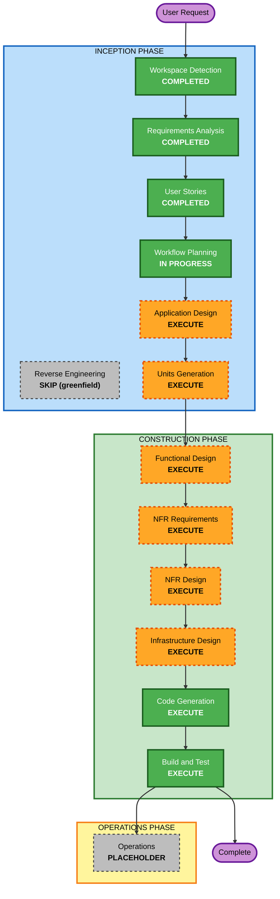

# Execution Plan — WC2026 Predictor

## Detailed Analysis Summary

### Project Type
- **Greenfield** (no existing codebase; only aidlc-rules/ and aidlc-docs/ present).

### Change Impact Assessment
- **User-facing changes**: Yes — entire product is new user-facing functionality (predicting, groups, leaderboards).
- **Structural changes**: Yes — new system architecture (React SPA + serverless API + DynamoDB + external API integration).
- **Data model changes**: Yes — new data models (Players, Groups, Memberships, Matches, Predictions).
- **API changes**: Yes — a new REST API surface.
- **NFR impact**: Yes — security (Baseline extension enabled), performance/cost (free-tier API limits, serverless), testability (Partial PBT on scoring).

### Risk Assessment
- **Risk Level**: Medium
- **Rollback Complexity**: Easy (greenfield; no production data/users to migrate).
- **Testing Complexity**: Moderate (scoring/lock logic + external API integration + per-group authorization).

### Key Architectural Decisions (from Requirements)
- Stack: React (frontend) + Node/Express (backend), JavaScript/TypeScript.
- Deploy: AWS serverless — Lambda + API Gateway + DynamoDB; React on S3/CloudFront.
- Identity: no accounts (name-based); groups via invite code.
- Extensions: Security Baseline (Full), Property-Based Testing (Partial).

## Workflow Visualization

### Text Alternative (always included)
- INCEPTION: Workspace Detection (COMPLETED) → Reverse Engineering (SKIP, greenfield) → Requirements Analysis (COMPLETED) → User Stories (COMPLETED) → Workflow Planning (IN PROGRESS) → Application Design (EXECUTE) → Units Generation (EXECUTE)
- CONSTRUCTION (per unit): Functional Design (EXECUTE) → NFR Requirements (EXECUTE) → NFR Design (EXECUTE) → Infrastructure Design (EXECUTE) → Code Generation (EXECUTE); then Build and Test (EXECUTE)
- OPERATIONS: Operations (PLACEHOLDER)

## Phases to Execute

### 🔵 INCEPTION PHASE
- [x] Workspace Detection (COMPLETED)
- [x] Reverse Engineering (SKIPPED — greenfield, nothing to reverse engineer)
- [x] Requirements Analysis (COMPLETED)
- [x] User Stories (COMPLETED)
- [x] Workflow Planning (IN PROGRESS)
- [ ] Application Design — **EXECUTE**
  - **Rationale**: New components and a service layer must be defined (identity, groups, fixtures, predictions, scoring, integration). Component methods and business rules need design.
- [ ] Units Generation — **EXECUTE**
  - **Rationale**: The system decomposes into multiple cohesive units (e.g., frontend SPA, backend API + domain logic, data/persistence, external-API integration, infrastructure). Structured breakdown clarifies build order and the per-unit Construction loop.

### 🟢 CONSTRUCTION PHASE (per unit)
- [ ] Functional Design — **EXECUTE**
  - **Rationale**: New data models/schemas and non-trivial business logic (scoring tiers, kickoff locking, knockout placeholders, tie-breakers). Also hosts PBT-01 property identification.
- [ ] NFR Requirements — **EXECUTE**
  - **Rationale**: Tech-stack selection (DynamoDB modeling, Lambda HTTP adapter, fast-check), plus performance/security/scalability targets. Hosts PBT-09 framework selection.
- [ ] NFR Design — **EXECUTE**
  - **Rationale**: NFR Requirements executes, so NFR patterns (logging, error handling, rate limiting, headers, encryption) must be designed in. Carries Security Baseline patterns.
- [ ] Infrastructure Design — **EXECUTE**
  - **Rationale**: Map to concrete AWS services (Lambda, API Gateway, DynamoDB, S3/CloudFront, IAM least-privilege, secrets manager, CloudWatch logs/alarms).
- [ ] Code Generation — **EXECUTE (ALWAYS)**
  - **Rationale**: Implementation planning and code/test generation.
- [ ] Build and Test — **EXECUTE (ALWAYS)**
  - **Rationale**: Build, run, unit/integration/PBT tests, and verification.

### 🟡 OPERATIONS PHASE
- [ ] Operations — PLACEHOLDER (future deployment/monitoring workflows)

## Estimated Timeline
- **Total Stages to Execute (remaining)**: 8 (2 Inception + 6 Construction across units)
- **Estimated Duration**: a few focused working sessions (each stage gated for approval).

## Success Criteria
- **Primary Goal**: A working FIFA-style predictor for the 2026 World Cup — name-based players, friend groups via invite code, exact-score predictions locking at kickoff, 5/3/2/0 scoring, per-group leaderboards, fed by a live football API; deployable to AWS serverless.
- **Key Deliverables**: React frontend; Node/Express API (Lambda-adaptable); DynamoDB data layer; scoring engine with PBT + example tests; external API integration with scheduled sync; IaC for AWS; build/test instructions.
- **Quality Gates**: Security Baseline compliance (no blocking findings) at each stage; Partial PBT enforced on scoring/serialization; all acceptance criteria from stories satisfied.

## Extension Compliance (Workflow Planning stage)
- 🔒 Security Baseline: Plan routes security work into NFR Design (patterns) and Infrastructure Design (encryption, IAM, logging, headers, secrets). No blocking findings at planning.
- 🧪 Property-Based Testing (Partial): Plan routes PBT-01 → Functional Design, PBT-09 → NFR Requirements, PBT-02/03/07/08 → Code Generation/Build & Test. No blocking findings at planning.
